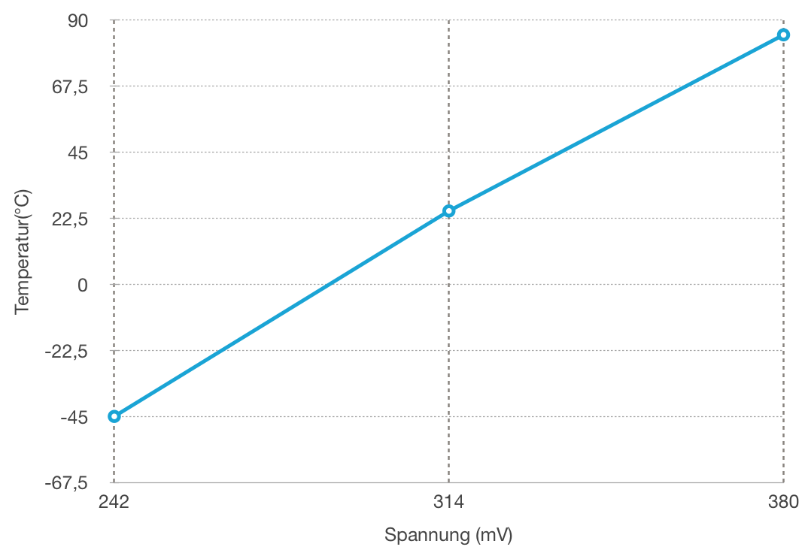

# Protokoll 7 (09.04.2019)  

Name: Breitenthaler Lorenz  
Klasse: 4ahme  
KNR: 1  
Gruppe: 1  

---
## Inhalte
1. Kalibrierung des Sensors  
2. Start der Kommunikation  
---

## 1. Kalibrierung des Sensors  

Um die Daten aus dem ADCH Register in eine Temperatur um zu rechen, wird eine Formel benötigt.
Da diese einen linearen Zusammenhand besitzen, kann dessen Grundform "y = k*x + d" verwendet werden.  
--> T = ADCH * k + d

|   | Temp | Spannung | ADCH | ModBusRegister   |  
|---|------|----------|------|------------------|
|A: | -45°C|  242mV   | 56,79| -45*256 = -11520 |  
|B: |  25° |  314mV   | 73,08|  25*256 = 6400   |  
|C: |  85° |  380mV   | 88,4 |  85*256 = 21760  |  



Bei genauer Betrachtung fällt auf, dass die Gerade aus dem Datenblatt einen Knick hat.  
Lösung: Zerlegung in zwei Geraden, wobei anschließend die Werte zur passenden Gerade zugeteilt werden müssen.  

Aus den vorliegenden Werten ergeben sich nun folgenden Gleichungen:  
`G1.  A - B  mrb1 = ADCH * 1100,06 - 73992,486`  
`G2. B - C   mrb2 = ADCH * 1002,61 - 66870,80`

Umsetzung in C:  
```C
void app_main (void) {
   ADCSRA |= (1 << ADSC);
   _delay_ms(1);


   // Werte laut Datenblatt
   float mrb;
   float k1 = 1100.061, d1 = -73992.486;
   float k2 = 1002.61, d2 = -66870.812;


   if(ADCH <= 88) { //Zuteilung der Werte zur passenden Gerade
      mrb = k1 * ADCH + d1;
   }else if (ADCH > 88 ){
      mrb = k1 * ADCH + d1;
   }

   printf("ADCH --> %u    Reg 1: %d   \r",ADCH, mrb);

}
```

Da jeder Controller eigen ist, muss in die Gleichungen noch ein Korrekturfaktor "o" eingebaut werden.
Diesen erhält man indem man die Aktuelle Temperatur und den dazu angezeigten ADCH Wert aus dem Programm in die oberen Gleichungen einsetzt. 
Da die aktuelle Temperatur nur über eine Wärmekammer oder ähnliches ermittelt werden kann, wurde der Wert auf 22°C angenommen.  
Diesen erhält man indem man die Aktuelle Temperatur und den dazu angezeigten ADCH Wert aus dem Programm in die oberen Gleichungen einsetzt.
Ausgangsgleichung: `5632(22°C) = 1100,06*87(ADCH Sollwert) -73992,486 - o`  

Lösungen:

`ADCH < 88 —> mbr1 = 1100,06*ADCH - 73992,486 - 16080,734`  
`ADCH > 88 —> mrb2 = 1002,61*ADCH - 66870,80 - 14724,27`

Einbau in des C Programm:  
```C
oid app_main (void) {
   ADCSRA |= (1 << ADSC);
   _delay_ms(1);


   // Werte laut Datenblatt
   float mrb;
   float k1 = 1100.061, d1 = -73992.486;
   float k2 = 1002.61, d2 = -66870.812;

   //Korrekturfaktoren
   float o1 = -16080.734, o2 = -14724.27;

   if(ADCH <= 88) {  // Zuteilung des Wertes zur passenden Gleichung
      mrb = k1 * ADCH + d1 + o1;
   }else if (ADCH > 88 ){
      mrb = k1 * ADCH + d1 + o1;
   }


   int16_t mbInputRegister1 = (int16_t)mrb;
   int8_t vk = mbInputRegister1 /256;
   uint8_t nk = ((mbInputRegister1 & 0xff) * 100) /256;

   printf("ADCH --> %u    Reg 1: %d   Temperatur: %d,%u \r",ADCH, mbInputRegister1, vk, nk);

   }
}
```

Am Ende des Programms wird noch der zu übertragende Wert in den Vorkomma und Nachkomma Wert aufgeteilt um nur ganzzahlige Werte  übertragen zu müssen.   


## 2. Start der Übertragung  

Als erstes muss die empfangene Request ausgelesen werden. Diese wird über UART gesendet und über die Standart Bibliotheksfunktion `fgetc` ausgelesen.  

```C
int c = fgetc(stdin);
   if (c != EOF){ // End Of File (-1)
      printf("\r\n %02x \r\n", (uint8_t)c);
      app_handleUartByte((char)c);
```
Die empfangenen Zeichen werden anschließnden der Funktion `app_handleUartByte((char)c)` übertragen um sie auszuwerten.

```C
void app_handleUartByte(char c){
   if(c == ':') {
      app.modbusBuffer[0] =c;
      app.bufferIndex = 1;
   } else {
      if(app.bufferIndex > 0){
	 app.modbusBuffer[app.bufferIndex++] = c;
      }
   }
}
```

Hierbei wird auf das Stratbyte ":" gewartet. Trifft dieses ein werden die nachfolgenden Zeichen in einem Buffer, welcher zuvor in einer Struktur in der Headerdatei festgelegt wurde, gespeichert.


```C
struct App
{
  uint8_t flags_u8;
  char modbusBuffer[32];
  uint16_t bufferIndex;
};
```
