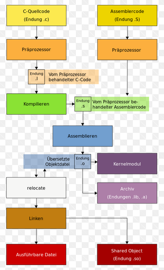

# Protokoll 5 #
Name: Skof Jonas  
Klasse: 4AHME  
KNR: 11  
Gruppe: 2  


| Anwesend  | Abwesend  |
|---|---|
| Korrenn,Murko,Orthofer,Perl,Szapacs | -  |


## Inhalte ##  
** 1. Wiederholung C-Kompilierungsvorgang **        
** 2. Der Kernel **        
** 3.  Das Kernelmodul  **       
** 4. Fertigstellen des Programms **          
           
***

# 1.Wiederholung C-Kompilierungsvorgang #

Es wurde ein weiteres mal diese Grafik durchbesprochen.
Vor allem ,warum man mit einem Kernelmodul den Kernel neu beschreiben kann, ohne das Betriebssystem neu starten zu müssen.

 

Für genauere Beschreibung ==> Siehe [4.Protokoll](protokoll_g2_skojom15_29.01.2019.md):


***
## 2. Der Kernel ##
Ein Kernel ist der zentrale Bestandteil eines Betriebssystems. In ihm ist die Prozess- und Datenorganisation festgelegt, auf der alle weiteren Softwarebestandteile des Betriebssystems aufbauen. Er bildet die unterste Softwareschicht des Systems und hat direkten Zugriff auf die Hardware. Weitere Softwarekomponenten eines Betriebssystems liegen in der Regel in einer übergeordneten Schicht.
Ein Kernel ist in Schichten aufgebaut, wobei die unteren Schichten die Basis für die darüberliegenden bilden.

Folgende Schichten sind vorhanden:

    * Schnittstelle zur Hardware 
    * Speicherverwaltung 
    * Prozessverwaltung
    * Geräteverwaltung 
    * Dateisysteme

*Quelle:* [hier](https://de.wikipedia.org/wiki/Kernel_(Betriebssystem))
***
# 3. Das Kernelmodul #
Ein Kernel-Modul ist ein spezielles Computerprogramm, das im laufenden Betrieb in den Kernel eines Betriebssystems geladen und wieder daraus entfernt werden kann.

Kernel-Module werden häufig für Gerätetreiber verwendet, da eine große Auswahl der Module für die unterschiedlichsten Hardware-Komponenten mit dem Betriebssystem mitgeliefert werden können, aber nur die wirklich benötigten Treiber in den Speicher geladen werden müssen.

Kernel-Module werden üblicherweise in der Programmiersprache C geschrieben und vor ihrem Laden in den Kernel und der späteren Ausführung dort, in die Maschinensprache für die jeweilige Ziel-Plattform übersetzt.

Ein weiterer Vorteil liegt darin, dass Erweiterungen für den Kernel integriert werden können, ohne dass das Betriebssystem neu gestartet werden muss. Denkbar wäre, dass man auf diese Weise den als Kernel-Modul realisierten Treiber einer Grafikkarte entfernt und eine neuere Version dieses Treibers in das laufende System einbindet. 

*Quelle:* [hier](https://de.wikipedia.org/wiki/Kernel-Modul)
***
# 4. Fertigstellen des Programms #

**main.c**

```c
#include <stdio.h>
#include "lcd.h"
#include "log.h"

void inti();
void show(char text[]);

int main()
{
 printf("Guten Morgen\n");
 lcd_init();
 log_init();
 struct LogRecord msg = {"main.c","Start..."};
 log_log(msg);
 show("Mal schauen...");
 return 0;
}
```

**log.c**

```c
#include <stdio.h>
#include "log.h"

void log_init()
{
 printf("LOG: init\n");
}
                                 
void log_log(struct LogRecord r) 
{
 printf("LOG: record %s: %s\n",r.src,r.message);
```

**log.h**
```c
#ifndef LOG_H
#define LOG_H

struct LogRecord   
{
char src[10];
char message[50];
};

void log_init();
void log_log(struct LogRecord r); 
 
#endif 
```
**lcd.c**
```c
#include <stdio.h>
#include "log.h"

void lcd_init()
{
 printf("LCD:init\n");
 struct LogRecord msg = {"lcd.c","init"};
 log_log(msg);
}

void show(char text[])
{
 printf("show: %s\n",text);
 struct LogRecord msg = {"lcd.c","shows");
 log_log(msg);
}

void showLog(struct LogRecord r)
{
  //...
}
```

**lcd.h**

```c

#ifndef LCD_H  
#define LCD_H

#include "log.h"

void lcd_init();
void show(char text[]);
void showLog(struct LogRecord r);

#endif

```

**Makefile:**
```c
a.out: main. o lcd.o log.o
        gcc main.o lcd.o log.o
main.o: main.c lcd.h log.h
        gcc -c main.c     
lcd.o: lcd.c
        gcc -c lcd.c
        
log.o: log.c
        gcc -c log.c
         
 
clean:
        -rm a.out
        -rm *.o   
```
***


