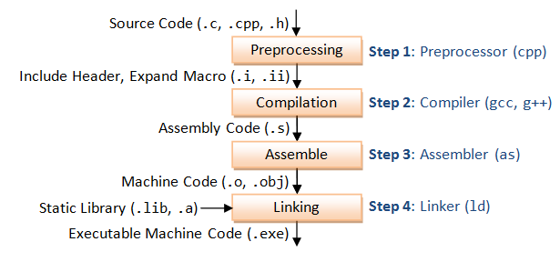

# Protokoll 4 #
Name: Skof Jonas  
Klasse: 4AHME  
KNR: 11  
Gruppe: 2  


| Anwesend  | Abwesend  |
|---|---|
| Korrenn,Murko,Orthofer,Perl,Szapacs | -  |


## Inhalte ##  
**1.  Wiederholung**        
**2.  Make-Tools**        
**3.  Makefiles**       
**4.  Funktionsweise von Makefiles**      
**4.1 Zeitstempel**       
**4.2 Möglich Auftretende Fehler**       
**5.  Übersetzung eines Programmes durch ein Makefile**            

***


# 1.Wiederholung C-Übersetzvorgang #


 

**Preprocessing** ==> Bearbeitung von Anweisungen wie #include oder #define. Da diese Datei im Normalfall nicht wirklich                          			    entsteht, gibt es auch keine eigene Endung.  
**Kompilieren** ==>		Der durch den Präprozzessor bearbeitete Code wird in Assmeblercode umgewandelt    
**Assemblieren** ==>	Der Assemblercode wird in Maschinencode übersetzt  
**Linken** ==>	      Alle Programmteile werden durch den Linker vereint. Daraus entsteht ein ausführbares Programm  
**Umwandeln** ==>	    Die ausführbare Datei wird in ein Format umgewandelt, das der Programmer versteht. (z.B. Hex) 

***

## 2. Make-Tool ##
make liest ein sogenanntes Makefile in dem die Abhängigkeiten des Übersetzungsprozesses von Programmen formalisiert erfasst sind. Diese Formalisierung beschreibt, welche Quelltextdateien auf welche Weise durch den Compiler oder durch andere Programme zu welchen Objektdateien bzw. Ergebnissen verarbeitet werden, bzw. welche Objektdateien vom Linker zu Programmbibliotheken oder ausführbaren Programmen verbunden werden. Alle Schritte erfolgen unter Beachtung der im Makefile erfassten Abhängigkeiten.
Der gesamte Übersetzungsvorgang wird im Normalfall durch das make-Tool übernommen.

**Anwendung:**
Die Entwicklung großer Programme und Programmpakete, die aus vielen einzelnen Quelltext-Dateien bestehen und Abhängigkeiten zu separaten Bibliotheken besitzen, ist ohne make oder ähnliche Hilfsmittel kaum mehr denkbar. In der Welt des Open Source ist es üblich, dass mit dem Quellcode eines Projekts auch das Makefile veröffentlicht wird, um das compilieren einer Software zu vereinfachen
***
# 3. Makefiles #
Das Kompilieren von Quelltext-Dateien kann mit dem Programm make gesteuert werden. Dies ist vor allem dann sinnvoll, wenn es sich um ein großes Projekt handelt bei dem die Kompilierung aus vielen einzelnen Schritten und Abhängigkeiten besteht. Die einzelnen Schritte können zum Beispiel separate Kompilierungen oder andere Dateioperationen wie Kopieren und Löschen sein. Abhängigkeiten können zum Beispiel bedingte Kompilierungen sein. Diese Schritte und Abhängigkeiten werden in ein Makefile zusammengefasst, welches dann vom Programm make verarbeitet wird.
Das sogenannte "maketool" benötigt eine "Makefile" (Textdatei), dieses tool übersetzt nur das Erforderliche. Es wird in der Makefile meist ein "Cleaner" eingebaut, der dazu dient alle vom Compiler erzeugten Datei zu löschen. Dies wird zum Beispiel mit dem Befehl -rm *.o gemacht.

Bei der C-Prpgrammierung verwendet man normalerweise für die Übersetzung des Programs eine IDE(Integrated Development Environment) wie zum Beispiel Codeblocks oder Netbeans. Diese IDE's greifen aber auch auf das Tool make zurück.

Wird make in der Konsole aufgerufen, so wird eine Steuerdatei names Makefile ausgeführt.
Bei richtiger Einstellung des Makefile wird nur das Nötigste gemacht und schon abgeschlossene Teile weggelassen.
Ein Makefile besteht aus:
   *  einem Ziel
   *  einer Abhängigkeit
   *  einem Befehl
```   
   Ziel 1: Abhängigkeit  
	     Befehl  
	     Befehl  
   Ziel 2: Abhängigkeit  
    	     Befehl 
    	     Befehl 
   Ziel 3: Abhängigkeit  
	     Befehl 
             Befehl 
```   

In der Datei Makefile befinden sich die relevanten Informationen für eine Übersetzung.

Zum Beispiel:
   *  was ist das Ziel der Übersetzung?
   *  aus welchen Dateien (Files) besteht das Projekt?
   *  welche Abhängigkeiten zwischen den Dateien sind gegegeben?
   *  welche Tools (z.b Compiler) werden wie aufgerufen?

***
# 4. Funktionsweise von Makefiles #
Beim Aufruf des Makefiles wird zuerst das erste Ziel aufgerufen. Die Abhängigkeiten werden dabei zuerst auf andere Ziele und dann auf Datein untersucht. Bei anderen Zielen als Abhängigkeit werden zuerst die abhängigen Ziele abgearbeitet. Bei Datein als Abhängigkeit wird der Zeitstempel von dem Ziel und der Datei verglichen um zu erfassen, ob ein neuerliches Durchführen der Kommandos überhaupt nötig ist.

## 4.1 Zeitstempel ##
Der Zeitstempel gibt an wann eine Datei das letzte Mal verändert wurde.Durch den Zeitstempel weiß der Compiler, ob er ein Programm kompilieren muss oder nicht, denn eine erneute Kompilierung wäre sinnlos.Dieser Vorgang spart sehr viel Zeit bei aufwändigeren Programmen.Mit dem Befehl touch kann dieser Zeitstempel auf Linux-Systemen aktualisiert werden.
  
## 4.2 Möglich Auftretende Fehler ##
Wenn das Makefile aufgerufen wird, läuft das Makefile soweit durch, bis ein Fehler auftritt. Das bedeutet, dass alle nachfolgenden Schritte nicht verarbeitet werden. Um das auftreten von Fehlern zu verhindern kann ein jeweiligen Kommando *-* eingefügt werden.

Durch den Rückgabewert der Kommandos lässt sich daraus schließen ob ein Fehler aufgetreten ist. Ist der Rückgabewert ungleich 0, so wird ein Fehler ausgegeben. In der Konsole kann der Rückgabewert des letzten Kommandos mit dem Befehl echo $? ausgeben werden.

***
# 5. Fertiges Programm #

**Main.c**

```c
#include <stdio.h>
#include "lcd.h"
#include "log.h"
int main()
{
  printf("Guten Morgen\n");
  log_init();
  lcd_init();
  show("Mal schauen...");
  return 0;
}
```

**Makefile**

```c
a.out: main.o lcd.o log.o
	gcc main.o lcd.o

main.o: main.c lcd.h log.h
	gcc -c main.c

lcd.o: lcd.c
	gcc -c lcd.c

log.o log.c
	gcc -c log.c

clean:
	-rm a.out
	-rm *.o 

```

**lcd.c**

```c
#include <stdio.h>
void lcd_init()
{
  printf("LCD: init\n");
}

void show(char text[])
{
  printf("show %s\n", text);
}

```

**lcd.h**

```c
void lcd_init();
```

**log.c**
```c
#include <stdio.h>
struct LogRecord
{
  char src[10];	//Quelle und Meldungs-Strings in Feldern speichern
  char message[50];
};

void log_init() 
{
  printf("LOG: init\n");
}

void log(struct LogRecord r)
{
  printf("LOG: record %s  : %s\n", r.src, r.message);
}

```
**log.h**
```c
void log_init();

```


